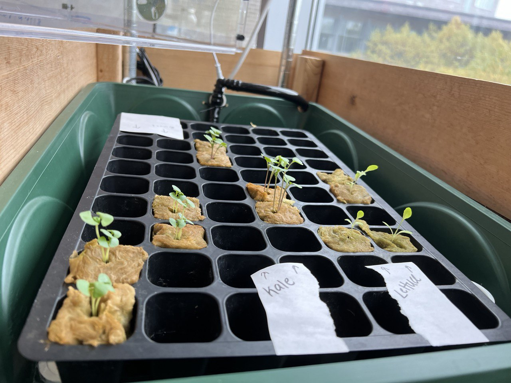

# Plant Detection and Measurement (PDM)
Ally Bell and Jonas Kazlauskas

In this project we hoped to explore the capabilities of computer vision in agriculture. This is a blossoming field of computation that has a lot of potential to impact the way we grow our food. Not only are there applications in agriculture of monitoring and predicting yeild over a season, there is potential to collect and monitor longer term data. Things such as different soil management, pesticide application, or watering can be obsered over many acres, allowing extended context to inform future decision and optimization. It also has applications in new styles of automated indoor hydroponics farms. As a testbed for exploring this topic, we used Olin Hydroponics' seedling cart that has small plants germinating. An image of this set up is shown below.

| Hydroponics Seedling Cart |
:----------------------:|
||

 The goal of our project was to ingest images of plants, detect their location, and perform some meaningful computation on them. The first step of identifying the location of a plant is important, and lays the groundwork for a plethora of applications. Our ideal implementation of this portion would be able to identify plants in multiple camera angles and lighting. Our meaningful computation that we settled on was calculating the leaf area of the plants in order to track growth over time. This measure can be used to understand growth rate and help us predict when plants should be transplanted out of the germination cart.

## Detecting Plants in an Image

There are many different ways to detect a plant from an image. Each method works best in different applications, and for our context we chose the following approach:

- Tranform image into LAB colorspace (lightness, green-red, blue-yellow)
- Apply a binary threshold on the green-red channel to select the plants and remove the background
- Apply a blur, fill, and dilation to reduce noise and cleanup the result
- Apply the resulting pixel map mask to the original image

We used the following image to test our algorithm:
| Original Plant Image |
:----------------------:|
||

### Transform the Image into LAB
Detecting images in the RGB colorspace is possible, but there are often better ways to represent image data. One common example is the Hue-Saturation-Value (HSV) colorspace, which reduces the impact of lighting on the images color. Another alternative is the LAB (lightness, green-red, blue-yellow) colorspace, which similarly separates lighting from color information. We chose the LAB colorspace as it gave us the highest distinction between our plants and the background. Below is a comparison between the green-red channel (a) in the LAB colorspace and the value channel from the HSV colorspace selected from our image.

LAB A Channel             |  HSV V Channel
:-------------------------:|:-------------------------:
  |  

### Binary Threshold
A binary threshold removes all pixels above or below a given value, leaving behind the object you hoped to detect. The effectiveness of this approach depends on a few important factors:
- Does the object have a solid or uniform appearance?
- Does the object differ in appearance to the background?
- What filters or transformations are applied to the image before taking a binary threshold?  

We applied a binary threshold on the A channel of the LAB image to remove the background. This mask could then be applied back to the original image. Results are shown below.  

| Detected Plants |
:----------------------:|
||

### Blurring, Fill, and Dilation

Blurring, fill, and dilation are techniques used to reduce noise and separation of objects when detected. To apply these effects a kernel is used. A kernel is a small matrix used to change the pixel values in an image. 
#### Median Blur
In our case, we first applied a median blur filter. This filter works by stepping through the image, looking at a 10x10 area of pixels. It calculates the median pixel value among those 100 pixels, and sets the center pixel to that value. It then repeats, moving throughout the image resulting in a blurred image. 
#### Fill
Fill is used to remove small holes in the image that are the result of noise or misidentified plants. Fill works by going through the image and creating a binary structure from the image. This binary structure changes any pixels in the image that are greater than 0 to a 1. Next, groups (any pixels touching each other) of pixels are labeled. These labeled groups are checked, and those under a certain size have their pixel values set to 0. This final mask is then applied back to the original image. An example of this fill is shown below.

| Unfilled | Filled |
:----------------------:|:----------------------:|
||

The drawback of using a fill is that this sets a minimum size for identifiable plants. For example, small sprouts that are just beginning to show on the image may be falsely filled in.

### Dilation
Dilation is a technique that attempts to fill in the structure of detected elements in an image. To do this a structuring element is used (a kernel). This kernel is moved throughout the binary image, and if any pixels in the kernel are 1, the center pixel is set to 1. This has the effect of smoothing out the edges. The effect of this filter on our image was not visually perceptible, but we kept it in as an additional safety net. Dilation explanation resource: https://www.cs.auckland.ac.nz/courses/compsci773s1c/lectures/ImageProcessing-html/topic4.htm

### Canny Edge Detection
An alternative to the above filtering that we explored is Canny Edge Detection. Our attempts on this are shown below. This method did not work well for a few reasons:
- The plant leaves overlap and are not distinct objects
- There are many other edges present in the image, that also overlap with the plants
- There is no way to distinguish plant edges from other edges in the image

| Canny Edge Detection | Canny Edge on LAB Image |
:----------------------:|:----------------------:|
||

## Measuring Plants

After detecting the plants, we were able to determing contour lines that surround each plant. This allowed us to calulate the area of plant within each contour line. This measurement gave us a combination of both size and height of the plant, because the plant gets closer to the camera as it grows taller.

Next, we wanted to be able to relate the area of the plant in pixels to a measurement in the real world. To do this we used the squares of the tray the plants are grown in. These squares are easily identifiable, and have a consistent dimension in the real world that we know and can use as a constant. By finding the square's size within the image, and scaling this to their known dimension, we were able to calculate the size of the plants. This normalizes plant dimensions over time to each other, regardless of a shifted height that the image was shot at, or different framing, because we have an object to scale off of. 

To detect the squares, we started with the OpenCV tool `findCountours`, which identifies shapes in an image based on pixel intensity

## Results

We looked at three images of the plants over time. The detected plants from each of these images is shown below. As you can see they grow larger over time. 

| 10/23 | 10/24 | 10/27 |
:----------------------:|:----------------------:|:----------------------:|
|||

We ran each of these images through our algorithm and calculated the area of each of the plants in the image. The results of these calculations are shown below. Each color in the image represents a different plant.

These results can help us calculate the growth rate of the plants over time, and predict when they will need to be harvested.

We decided to use PlantCV as the main package for this project. This was an early design decision that allowed us to focus on the higher level concepts and applications of computer vision without getting lost in the implementation details. However, this lead to some limitations in the flexibility of our algorithm, such as calculating the size of the plants. 

## Challenges

While working on this project one problem we struggled with was calculating the area of the plants in the image. In PlantCV the typical workflow is the manually define regions that you want to analyze, and calculate the size of objects in that region. This did not fit with our goals of making a flexible algorithm, and led us to using a roundabout method for calculating the area. Instead of using PlantCV we instead used an algorithm called the [shoelace formula](https://en.wikipedia.org/wiki/Shoelace_formula) to calculate the area within a polygon. 

## Future Improvements  

We identified a number of improvements that could make this project better in the future:
- Add in debugging features that can help us understand and visualize what our algorithm is doing throughout each of its steps
- Test our algorithm with other images and angles to understand its limitations
- Add in an additional step to automatically crop the image to only include the black tray, or make the algorithm more flexible about what is in the image
- Add in the abilitiy to count the number of squares in the image, and partition the analysis based on these squares
- With the above step, we could then use PlantCV built in analysis, and add some calculations that analyze the shape of the plant as it grows

## Lessons

- Computer vision is brittle, and difficult to generalize, especially without the use of any machine learning. Our algorithm for detecting and measuring these plants is able to account for different heights and angles of the image, but not anything beyond that, such as drastially different cropping or a different size of seedling bed.
- Before starting a project in computer vision, it is extremely important to narrow down the context and understand what the input images will be. Starting from a place of wanting any image to work, without being specific about scope gives you nothing to build a foundation on.
- RGB images can be used in plant analysis, but for more advanced metrics like thermal imaging or other alternatives can give more useful data
