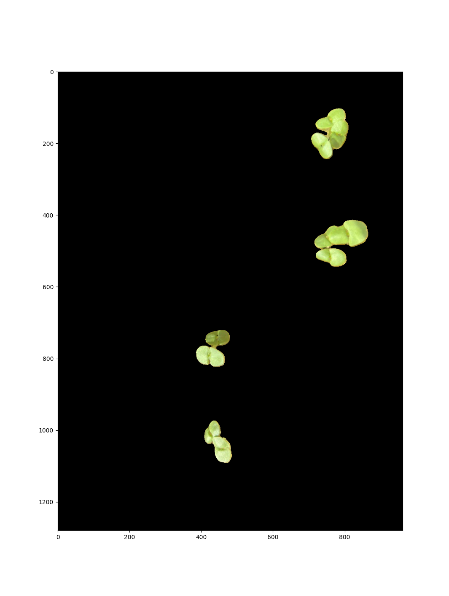

# Plant Detection and Measurement (PDM)
#TODO make a better name

What was the goal of your project? Since everyone is doing a different project, you will have to spend some time setting this context.

How did you solve the problem (i.e., what methods / algorithms did you use and how do they work)? As above, since not everyone will be familiar with the algorithms you have chosen, you will need to spend some time explaining what you did and how everything works.

## Detecting Plants in an Image

There are many different ways to detect a plant from an image. Each method works best in different applications, and for our context we chose the following approach:

- Tranform image into LAB colorspace (lightness, green-red, blue-yellow)
- Apply a binary threshold on the green-red channel to select the plants and remove the background
- Apply a blur, fill, and dilation to reduce noise and cleanup the result
- Apply the resulting pixel map mask to the original image

We used the following image to test our algorithm:
| Original Plant Image |
:----------------------:|
||

### Transform the Image into LAB
Detecting images in the RGB colorspace is possible, but there are often better ways to represent image data. One common example is the Hue-Saturation-Value (HSV) colorspace, which reduces the impact of lighting on the images color. Another alternative is the LAB (lightness, green-red, blue-yellow) colorspace, which similarly separates lighting from color information. We chose the LAB colorspace as it gave us the highest distinction between our plants and the background. Below is a comparison between the green-red channel (a) in the LAB colorspace and the value channel from the HSV colorspace selected from our image.

LAB A Channel             |  HSV V Channel
:-------------------------:|:-------------------------:
  |  

### Binary Threshold
A binary threshold removes all pixels above or below a given value, leaving behind the object you hoped to detect. The effectiveness of this approach depends on a few important factors:
- Does the object have a solid or uniform appearance?
- Does the object differ in appearance to the background?
- What filters or transformations are applied to the image before taking a binary threshold?  

We applied a binary threshold on the A channel of the LAB image to remove the background. This mask could then be applied back to the original image. Results are shown below.  

| Detected Plants |
:----------------------:|
||

We explored a few other techniques for plant detection that did not work as well.

| Canny Edge Detection | Canny Edge on LAB Image |
:----------------------:|:----------------------:|
||

#TODO Why does edge detection fail here?

## Measuring Plants

#TODO

Describe a design decision you had to make when working on your project and what you ultimately did (and why)? These design decisions could be particular choices for how you implemented some part of an algorithm or perhaps a decision regarding which of two external packages to use in your project.

What if any challenges did you face along the way?
What would you do to improve your project if you had more time?

Did you learn any interesting lessons for future robotic programming projects? These could relate to working on robotics projects in teams, working on more open-ended (and longer term) problems, or any other relevant topic.